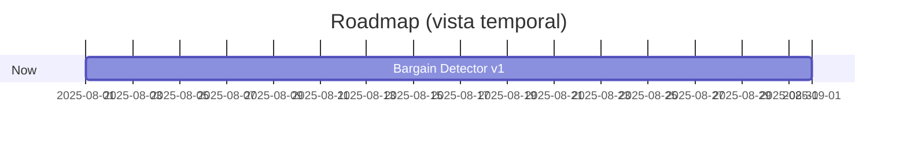

# Roadmap de Kezan Protocol

Leyenda de estado:
- [x] Completado
- [~] En desarrollo
- [ ] Pendiente

Metadatos opcionales por item (para mejor priorización y tracking):
- `{impact: must|nice}` → impacto (must-have vs nice-to-have)
- `{progress: NN%}` → avance estimado (0–100)
- `{deps: Tarea A, Tarea B}` → dependencias por título (coinciden con otros items del roadmap)
- `{start: YYYY-MM-DD, end: YYYY-MM-DD}` → ventana temporal (usada para Gantt opcional)
 - `{stage: T0|T1|T2|T3|SIM|INGEST|UX}` → capa del flujo en cascada o ámbito (SIM=simulador, INGEST=ingesta, UX=interfaz)
 - `{compliance: required}` → requiere validación de guardarraíles (asesoría-only)
 - `{activate_when: ...}` → condición de activación (por ejemplo métricas de uso/retención)

Ejemplo:
`- [~] Bargain Detector v1 {impact: must, progress: 40%, deps: SavedVariables compacto} {start: 2025-08-01, end: 2025-09-01}`

## Metas por horizonte
### Now (0–4 semanas)
- [~] Parser/validador DSL completo (BETWEEN/EXISTS/AND/OR/NOT y AST seguro) {impact: must, stage: T3, compliance: required}
- [~] Bargain Detector v1 (reglas + scoring heurístico + telemetría mínima) {impact: must, stage: T1}
- [ ] Simulador v1 (backtests 14d, ROI/volatilidad/tiempo de salida) {impact: must, stage: SIM}
- [ ] Worker horario Bot (OAuth, snapshots gzip, retención) {stage: INGEST}
- [ ] UI “Hoy, haz esto” (asesoría-only con OPEN_AH_SEARCH/COPY_POST_STRING) {stage: UX, compliance: required}
 - [ ] API: /simulate (POST) para ejecutar escenarios de backtest {stage: SIM}
 - [ ] API: /premium-check (GET) para control de acceso por plan {stage: UX}

### Next (1–3 meses)
- [ ] ML ranking (LightGBM) y dataset etiquetado con feedback loop semanal
- [ ] Premium: /premium-check + control de acceso + límites por plan
- [ ] Generador de reglas DSL asistido por IA (wizard) {impact: nice, stage: T3, compliance: required}
 - [ ] Reranking con embeddings y contexto (bge/e5 small) {stage: T2}

### Later (3–6 meses)
- [ ] PWA/móvil (alertas push y panel de oportunidades) {impact: nice, stage: UX, activate_when: active_users≥100 & retention_D30≥30%, deps: UI “Hoy, haz esto”}
- [ ] Motor de embeddings para contexto de parches/notas y reranking

## Ejes por componente
### Addon (LUA)
- [~] SavedVariables: estructura compacta items/playerStats
- [ ] Escaneos selectivos + full scan con throttling
- [ ] UI de recomendaciones (modo asesoría-only)

### Bot históricos (nube)
- [ ] Workers/Actions + almacenamiento S3/KV + claves region:realm:YYYY-MM-DDTHH.json.gz
- [ ] Compresión y deduplicación

### Cliente (PC)
- [x] Compliance asesoría-only (RECOMMEND_*, OPEN_AH_SEARCH, COPY_POST_STRING)
- [~] Integración LLM (Ollama/LM Studio) con plantillas y guardarraíles {impact: must, stage: T3, compliance: required}
- [~] Bargain Detector v1 integrado con históricos locales/nube {impact: must, stage: T1}
- [ ] Simulador v1 {stage: SIM}
 - [ ] API local: /simulate, /premium-check, /health {stage: UX}

## Entregables y aceptación
- Cada item debe enlazar a issue/epic con criterios de aceptación (inputs/outputs, límites, métricas), pruebas (≥95% cobertura) y docs/README/CHANGELOG actualizados.

## Notas
- El Prompt Maestro mantiene un snapshot del Roadmap; este archivo (docs/ROADMAP.md) es la fuente de verdad.

## Visualización (opcional)
- Kanban: usa el Project "Roadmap" en GitHub (columnas: Pendiente, En desarrollo, Completado).
- Gantt (mermaid): añade `{start: YYYY-MM-DD, end: YYYY-MM-DD}` a los items y genera un diagrama con una herramienta externa o un script (opcional). Un ejemplo de bloque mermaid:

## Checkpoints de cumplimiento (Blizzard‑safe)
- Cada feature marcada con `{compliance: required}` debe pasar revisión de guardarraíles (modo asesoría, sin automatización del cliente, acciones permitidas DSL) antes de marcarse como [x] Completado.
- Validaciones mínimas: preámbulo asesor, sanitización DSL, auditoría de logs y cero side-effects hacia el cliente de WoW.
